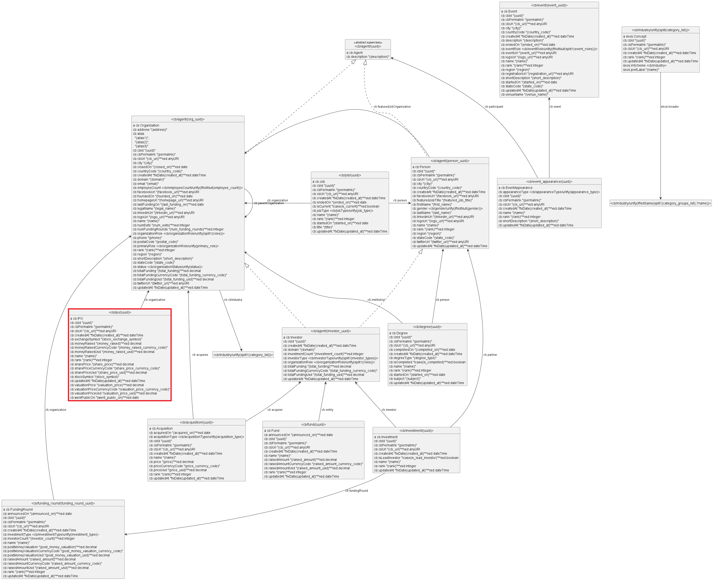
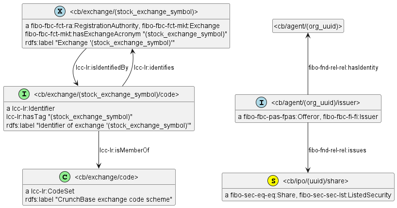
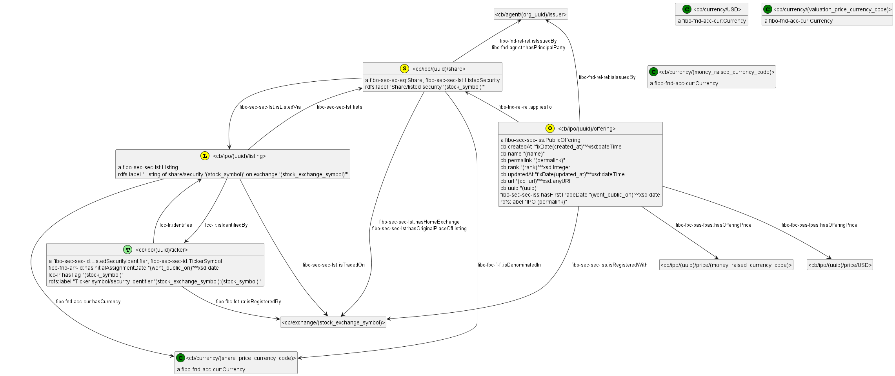
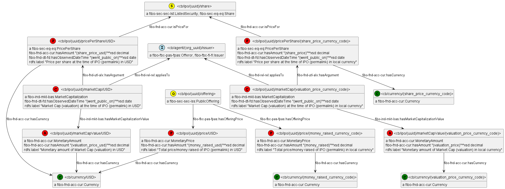

# Introduction

The [Financial Industry Business Ontology](https://spec.edmcouncil.org/fibo/) (FIBO) by the Enterprise Data Management Council (EDMC)
is a family of ontologies and a reference model for representing data in the financial world using semantic technologies.
It is used in fintech Knowledge Graph (KG) projects because it offers a comprehensive and principled approach to representing financial data,
and a wide set of predefined models that can be used to implement data harmonization and financial data integration.
The 2022Q2 FIBO release consists of 290 ontologies using 380 prefixes 
(see [@allemangInfrastructureCollaborativeOntology2021; @garbaczReasoningFIBOOntology2022] for details) 
that cover topics such as
legal entities, contracts, agency, trusts, regulators, securities, loans, derivatives, etc.
FIBO's reach and flexible ontological approach allow the integration of a wide variety of financial data,
but it comes at the price of more complex representation.

Crunchbase (CB) is a well-known dataset by TechCrunch that includes companies, key people, funding rounds, acquisitions, Initial Public Offerings (IPOs), etc.
It has about 2M companies with a good mix of established enterprises (including 47k public companies), mid-range companies and startups.
We (Ontotext and other Wikidata contributors) have matched 72k CB companies to  Wikidata, see [this query](https://w.wiki/7Q8b).

I explore the representation of Crunchbase data (more specifically IPOs) in FIBO
and compare it to the simplest possible semantic representation.
I therefore illustrate the complexity of FIBO, and explain its flexibility along the way.
I finish with some discussion and conclusions as to when FIBO can bring value to fintech KG projects.

## Open Source Project

This example is available as open source at https://github.com/VladimirAlexiev/crunchbase-fibo
and includes the following files:

- `Makefile`: orchestrate file generation with `make`
- `ipos-sample.csv`: 4 sample CSV rows
- `cb-model.ttl, cb-model.png`: simple CB model (all CB data) and generated image
- `ipos-agents.ttl, ipos-agents.png`: part of model and generated image
- `ipos-offering.png, ipos-offering.ttl`: part of model and generated image
- `ipos-financials.png, ipos-financials.ttl`: part of model and generated image
- `ipos-currencies.ttl, ipos-currencies.png`: part of model and generated image
- `ipos-fibo.ttl, ipos-fibo.png`: full FIBO IPO model (concatenated) and generated image
- `ipos-fibo.ru`: OntoRefine SPARQL UPDATE transformation generated from the full FIBO IPO model
- `common.h`: C preprocessor file with SPARQL "functions" used in generating transformation
- `prefixes.ttl, prefixes.rq`: all used prefixes in Turtle and SPARQL format
- `README.md, README.html`: this writeup
- `bibliography.bib, bibliography.html`: bibliography source and rendered HTML
- `acm-sig-proceedings-long-author-list.csl`: bibliography style
- `pandoc-defaults.yaml`: pandoc settings
- `pandoc-header.html`: JavaScript to enable syntax highlighting
- `css/*`: styles for syntax highlighting

# Crunchbase Data

Crunchbase consists of 18 tables (available as CSV and a JSON API) that cover companies, universities, persons, financial transactions, events (conferences and workshops), etc.
The gist [Crunchbase Challenge](https://gist.github.com/VladimirAlexiev/d5d67feb002dbcfa6b3d4c3dd59b52da) describes the complete database, but in this blog post I focus on Initial Public Offerings (IPOs).
An IPO is when a company goes public (is listed at a stock exchange and starts trading), which is considered one possible "exit" for its investors and founders.

Crunchbase has a table `ipos` with the following fields:

| field                         | type     | descr                                                               |
|-------------------------------|----------|---------------------------------------------------------------------|
| uuid                          | string   | Unique identifier, never changes                                    |
| name                          | string   | Entity name (often empty for IPOs)                                  |
| type                          | string   | Entity type (always "ipo" for IPOs)                                 |
| permalink                     | string   | Suffix of cb_url. Despite the name, sometimes changes               |
| cb_url                        | anyURI   | Full Crunchbase URL of the IPO event                                |
| rank                          | integer  | Crunchbase rank (smaller is "more important")                       |
| created_at                    | dateTime | When the Crunchbase record was created                              |
| updated_at                    | dateTime | When the Crunchbase record was updated                              |
|                               |          |                                                                     |
| org_uuid                      | string   | Points to the company that was listed                               |
| stock_exchange_symbol         | string   | Exchange code. Uses internal Crunchbase codes that are ambiguous    |
| stock_symbol                  | string   | Ticker on the exchange                                              |
| went_public_on                | dateTime | When the company went public (IPO date)                             |
| share_price_usd               | decimal  | The share price for the stock at the time of IPO, in US dollars     |
| share_price                   | decimal  | The share price for the stock at the time of IPO, in local currency |
| share_price_currency_code     | string   | Local currency of share price                                       |
| valuation_price_usd           | decimal  | Valuation of the Organization at IPO, in US dollars                 |
| valuation_price               | decimal  | Valuation of the Organization at IPO, in local currency             |
| valuation_price_currency_code | string   | Local currency of the valuation                                     |
| money_raised_usd              | decimal  | Total amount raised from the IPO, in US dollars                     |
| money_raised                  | decimal  | Total amount raised from the IPO, in local currency                 |
| money_raised_currency_code    | string   | Local currency of the total amount raised                           |

There are also organization attributes (`org_name, org_cb_url, country_code, state_code, region, city`) that are redundant, thus not shown above.

- The first 8 fields are present in pretty much every CB entity
- The next 13 fields are specific to the IPO entity
- `stock_exchange_symbol` uses internal Crunchbase exchange codes that are sometimes ambiguous
  (for example, "MSE" may mean the Madrid Stock Exchange, Metropolitan Exchange in India, Mongolia Stock Exchange, etc).
  We (Ontotext) have mapped all 156 codes to Wikidata, together with the unambiguous Market Identification Codes (ISO 10383 MIC),
  see [this query](https://w.wiki/7Q8c):

```sparql
select ?item ?itemLabel ?cb ?mic {
  ?item wdt:P7534 ?mic;             # ISO MIC
     p:P528 [ps:P528 ?cb;           # catalog code
             pq:P972 wd:Q10846831]. # catalog
  service wikibase:label { bd:serviceParam wikibase:language "[AUTO_LANGUAGE],en". }
}
```

- `stock_symbol` is the company code on that exchange.
  This is a valuable field for coreferencing public companies across datasets, but one should beware that:
  - Stock symbols are only 85% unique world-wide, so they need to be interpreted in conjunction with the Exchange field
  - The same company may have several stock symbols (even on the same exchange over time), and symbols may be sold and bought between companies over time
- "Share price" is the stock price at the time of IPO (not sure whether the opening or closing price)
- "Valuation" (market capitalization) is the product of all outstanding shares times the share price
- "Money raised" is the product of share price times the shares sold during the IPO
- These 3 financial factors are represented with 3 fields each, to account for local currencies and USD

For example, here are the first 4 CB IPO records

| field                         | example1                                               | example2                                                             | example3                                          | example4                                              |
|-------------------------------|--------------------------------------------------------|----------------------------------------------------------------------|---------------------------------------------------|-------------------------------------------------------|
| uuid                          | 72d30ebd-53ef-2486-6c29-22785c5173ce                   | 3ad2b068-2d97-f646-0b80-1e5f3d7adfc4                                 | a265c6f6-4b96-4079-096a-967a37f3da2b              | ee426509-826e-5dd0-9309-e79c8f384904                  |
| type                          | ipo                                                    | ipo                                                                  | ipo                                               | ipo                                                   |
| permalink                     | microsoft-ipo--72d30ebd                                | the-walt-disney-company-ipo--3ad2b068                                | divx-ipo--a265c6f6                                | xo-group-ipo--ee426509                                |
| cb_url                        | https://www.crunchbase.com/ipo/microsoft-ipo--72d30ebd | https://www.crunchbase.com/ipo/the-walt-disney-company-ipo--3ad2b068 | https://www.crunchbase.com/ipo/divx-ipo--a265c6f6 | https://www.crunchbase.com/ipo/xo-group-ipo--ee426509 |
| rank                          | 31712                                                  | 44186                                                                | 14752                                             | 19369                                                 |
| created_at                    | 2008-02-09 05:25:18                                    | 2008-02-09 05:40:32                                                  | 2008-02-25 23:52:11                               | 2008-02-29 00:31:34                                   |
| updated_at                    | 2018-02-12 23:11:05                                    | 2019-02-25 22:31:49                                                  | 2018-02-12 23:57:54                               | 2018-02-12 23:41:42                                   |
| org_uuid                      | fd80725f-53fc-7009-9878-aeecf1e9ffbb                   | 756936c0-c335-f0ae-0a3d-fe26bdff5695                                 | 73296f0d-85a5-78d5-90b3-86c5f8981ba9              | ff8439cf-097c-a88a-9bb9-dd83d23aa14b                  |
| stock_exchange_symbol         | nasdaq                                                 | nyse                                                                 | nasdaq                                            | nyse                                                  |
| stock_symbol                  | MSFT                                                   | DIS                                                                  | DIVX                                              | XOXO                                                  |
| went_public_on                | 1986-03-13                                             | 1978-01-13                                                           | 2006-10-22                                        | 1999-12-02                                            |
| share_price_usd               |                                                        |                                                                      | 16.0                                              |                                                       |
| share_price                   |                                                        |                                                                      | 16.0                                              |                                                       |
| share_price_currency_code     |                                                        |                                                                      | USD                                               |                                                       |
| valuation_price_usd           |                                                        |                                                                      | 160000000                                         |                                                       |
| valuation_price               |                                                        |                                                                      | 160000000                                         |                                                       |
| valuation_price_currency_code |                                                        |                                                                      | USD                                               |                                                       |
| money_raised_usd              |                                                        | 300000000                                                            | 145000000                                         | 35000000                                              |
| money_raised                  |                                                        | 300000000                                                            | 145000000                                         | 35000000                                              |
| money_raised_currency_code    |                                                        | USD                                                                  | USD                                               | USD                                                   |


# Simple Semantic Model of Crunchbase

The simplest possible semantic representation of CB uses one class per table
(subsidiary tables like `org_descriptions` and `org_parent` are merged to other classes; and `org_parents` is a direct RDF relation).

I make URLs based on entity type and `uuid`.
I leverage the fact that UUIDs are globally unique (no conflicts between classes) to put `Organizations` and `People` under the abstract superclass `Agent` and in the same URL namespace `cb/agent`:
this is needed since some financial transactions (in particular `funding_round`) can involve a mix of persons and organizations.

The following diagram shows the complete CB semantic model of 18 entities:



It is generated from a semantic model in Turtle format (`cb-model.ttl`) using [rdfpuml](https://github.com/VladimirAlexiev/rdf2rml) [@Alexiev2016-rdfpuml-rdf2rml] and [PlantUML](https://plantuml.com/download).
This model is concatenated from 18 individual per-table models that include source field names in parentheses (also seen on the overall model).

The individual models are used to generate semantic transformations for [Ontotext Refine](https://platform.ontotext.com/ontorefine/) in the form of SPARQL Update queries.
The same updates are used for both initial ingest and update, leveraging a global timestamp and using named graphs per each table row (over 10M graphs).
See gist [Crunchbase Challenge](https://gist.github.com/VladimirAlexiev/d5d67feb002dbcfa6b3d4c3dd59b52da) and [@Alexiev-ENDORSE-2023] for more details,
including the model source `cb-model.ttl` and timing (performance) information of the semantic conversions.

**Important**: Please note that this model covers all of CB, not just CB IPOs.
The IPO class (node) is shown with red border.

# FIBO Model of Crunchbase IPOs

Now I turn to representing IPOs in FIBO by using the ontologies from the FIBO 2022Q2 release (see gist [Converting FIBO from RDF to Turtle](https://gist.github.com/VladimirAlexiev/a4d9d715c5d079378384f3a30c8ce061)).

I use the following colors in the diagrams below.

- lightblue: agents (Offeror=Issuer, Exchange=RegistrationAuthority)
- yellow: Shares and share-related events (Offering, Listing)
- red: Financial factors (share price, market capitalization, money raised)
- green: currencies (and their codes)
- lightgreen: other codes and codesets

See the next sections for entity diagrams of different kinds of entities (partial models),
followed by an overall model diagram, and a binding of the colors to specific RDF classes.

## IPO Agents

First I represent the agents involved in the IPO: Exchange and Issuer.
(Perhaps the main agent is the public that invests money into the shares, but they are not individually represented in FIBO).



- Stock exchanges are identified by internal CB codes.
  (As mentioned above, some CB Exchange codes are ambiguous, unlike the ISO 10383 MIC standard).
  - FIBO distinguishes between entities and their identifiers/codes in various coding schemes, which allows us to capture the CB exchange code scheme.
  - A FIBO related project is working on representing the MIC coding scheme, which involves not just exchanges and their primary markets, but also secondary markets on these exchanges.
  - A future effort could coreference CB and MIC exchanges precisely in FIBO, leveraging our work in Wikidata.
- FIBO distinguishes the share Issuer/Offeror (a role) from the Agent playing that role (a CB organization)
- As you can see, many entities obtain multiple types (classes). This allows to capture not only typical situations (as per CB) but also to cover exceptional corner cases
  - The `Issuer` of shares is typically also their `Offeror`, but I guess it's possible for the Offeror to be a third party
  - The `Exchange` is also typically the `RegistrationAuthority` of tickers and shares on that exchange, but I guess exceptions are possible

## Share, Offering, Listing, Ticker

Now I represent the main entities of the IPO event, which in FIBO are:

- Share
- Offering of the share to the general public
- Listing of the share at a stock exchange
- Ticker that is allocated to the share



Please note that `PublicOffering` includes a number of non-FIBO properties (i.e. CB custom properties):

```ttl
  cb:uuid '(uuid)';
  cb:name '(name)';
  cb:permalink '(permalink)';
  cb:url '(cb_url)'^^xsd:anyURI;
  cb:rank '(rank)'^^xsd:integer;
  cb:createdAt 'fixDate(created_at)'^^xsd:dateTime;
  cb:updatedAt 'fixDate(updated_at)'^^xsd:dateTime.
```

Truth be told, these are not very semantic:

- They include CB data about an event (`name, permalink, url, rank`) that is not properly attributed to CB;
  - `url` could be mapped to a standard FIBO property.
    FIBO has a property for "home page" but it's not fair to say that CB's page about an IPO is its home page,
    because in all likelihood there are better pages at the Exchange and Company websites describing the IPO
  - If you need a proper ontology for representing web pages and their relation to real-world things, use `schema.org`.
    It has no less than 5 properties for relations of varying strength and nuance: `url, sameAs, mainEntity, about, mentions`.
    (And there's also `keywords` used for free-text keywords.)
- They also include book-keeping information (`uuid, createdAt, updatedAt`)
  that is not about the event, but about CB's **record** of the event.

However, I didn't want to complicate the model even further by placing these fields in yet more FIBO nodes.
Furthermore, we'd have to repeat the same event nodes for both `Offering` and `Listing`.

## Financial Factors

The 3 financial factors (share price, market capitalization, money raised) are expressed in 2 currencies each:



Of the 3 factors, Market Capitalization is represented using a more complex pattern:

- The `<.../marketCap/...>` node being `MarketCapitalization`, which is based on the `pricePerShare` has has value `<.../marketCapValue/...>`
- The `<.../marketCapValue/...>` node being `MonetaryAmount`

Please note the URL patterns used by the financial nodes in "national currency" vs in "USD":
```
<cb/ipo/(uuid)/pricePerShare/(share_price_currency_code)>      vs <cb/ipo/(uuid)/pricePerShare/USD>
<cb/ipo/(uuid)/marketCap/(valuation_price_currency_code)>      vs <cb/ipo/(uuid)/marketCap/USD>
<cb/ipo/(uuid)/marketCapValue/(valuation_price_currency_code)> vs <cb/ipo/(uuid)/marketCapValue/USD>
```

In an initial version of the mapping, I used a simpler pattern:
```
<cb/ipo/(uuid)/pricePerShare>                                  vs <cb/ipo/(uuid)/pricePerShareUsd>
<cb/ipo/(uuid)/marketCap>                                      vs <cb/ipo/(uuid)/marketCapUsd>
<cb/ipo/(uuid)/marketCapValue>                                 vs <cb/ipo/(uuid)/marketCapValueUsd>
```

The difference is subtle but crucial: the current URL pattern effectively merges the financial nodes where the "national currency" is "USD".
Since many IPOs are denominated in USD, I can save a significant number of nodes by using URL patterns that incorporate the currency code.

I assume that the monetary fields (eg `(money_raised)` vs `(money_raised_usd)`) are identical for US IPOs.
If that's true, then the multiple instances of the same statement will be collapsed by the semantic repository on data ingestion,
so we won't have duplicate statements in the repository.

## Currencies

Finally, I represent the currencies used for the Financials.
This includes USD plus up to 3 national currencies for the 3 financials.
(I can't imagine an IPO that would use different national currencies for its 3 financials, but Crunchbase has used separate fields, so I represent separate nodes).


Please note that these nodes are shared between all IPOs, so they are not a large number.
And for IPOs that use the same currency for their 3 financials, only 1 pair of nodes will be generated.

FIBO distinguishes betwen currencies and their codes in a particular code set (in this case "CrunchBase currency code set").
But CB uses ISO 4217 standard currency codes, and FIBO already includes such data in the ontology `FND/Accounting/ISO4217-CurrencyCodes.rdf`, e.g.:

```ttl
fibo-fnd-acc-4217:USD
  rdf:type           fibo-fnd-acc-cur:CurrencyIdentifier , owl:NamedIndividual ;
  lcc-lr:hasTag      "USD" ;
  rdfs:label         "USD" ;
  lcc-lr:denotes     fibo-fnd-acc-4217:USDollar ;
  lcc-lr:identifies  fibo-fnd-acc-4217:USDollar ;

fibo-fnd-acc-4217:USDollar
  rdf:type                       fibo-fnd-acc-cur:Currency , owl:NamedIndividual ;
  lcc-lr:hasName                 "US Dollar" .
  rdfs:label                     "US Dollar" ;
  fibo-fnd-acc-cur:hasNumericCode "840" ;
  lcc-cr:isUsedBy                lcc-3166-1:VirginIslandsBritish ...
```

So why didn't I reuse the FIBO currency nodes and instead made CB currency nodes?
The reason is subtle and is described in [fibo/issues/1816](https://github.com/edmcouncil/fibo/issues/1816):

- As you can see above, currency nodes use the currency name, eg `fibo-fnd-acc-4217:USDollar`
- But in CB we have the currency code, eg `USD`
- The financial nodes must connect to the **currency** nodes, not the **currency code** nodes
- Given `fibo-fnd-acc-4217:USD`, we can very easily find `fibo-fnd-acc-4217:USDollar` with a simple SPARQL query
- However, most semantic ETL tools (e.g. TARQL, RML, Karma) cannot run a SPARQL query (or even access a simple RDF pattern) while performing ETL over tabular data
- Only tools like OntoRefine, [SPARQL Generate](https://ci.mines-stetienne.fr/sparql-generate/) and [XSPARQL](https://www.w3.org/Submission/xsparql-language-specification/) can join tabular source data to RDF data in a repository.

So I decided to play it safe and use the CB currency nodes.
The EDM Council has agreed to change the node names a bit to:

```
fibo-fnd-acc-4217:CurrencyCode-USD, fibo-fnd-acc-4217:Currency-USDollar
```

And to add a separate coreferencing file that will have `sameAs` statements for each currency like this:

```ttl
fibo-fnd-acc-4217:Currency-USDollar owl:sameAs fibo-fnd-acc-4217:Currency-USD
```

Generated with the following SPARQL query:

```sparql
construct {
  ?curr owl:sameAs ?currAsCode
} where {
  ?code a fibo-fnd-acc-cur:CurrencyIdentifier; lcc-lr:hasTag ?c; lcc-lr:identifies ?curr.
  bind(iri(concat(str(fibo-fnd-acc-4217:),"Currency-",?c)) as ?currAsCode)
}
```

This will effectively add alias URLs for each currency (the two `sameAs` URLs shown above),
so now external data like CB can safely refer to **currency** nodes like `fibo-fnd-acc-4217:Currency-USD`.

## Overall FIBO IPOs Model

Finally, I present the overall FIBO IPOs model:


It's a complex graph:

- It has 25 nodes, of which 11 are shared with other IPOs (the currencies and currency codes) and 14 are per-IPO
- It has 136 triples; compare to the simplest model that uses 1 node and 22 triples
<!-- cat prefixes.ttl ipos-fibo.ttl | riot -syntax ttl -out ntriples | grep -vi plantuml | wc -l -->
- It uses terms from 16 FIBO ontologies (see [prefixes.ttl](prefixes.ttl)).

```ttl
@prefix cb:   <https://ontotext.com/crunchbase/ontology/> .

@prefix fibo-fbc-fct-mkt:  <https://spec.edmcouncil.org/fibo/ontology/FBC/FunctionalEntities/Markets/> .
@prefix fibo-fbc-fct-ra:   <https://spec.edmcouncil.org/fibo/ontology/FBC/FunctionalEntities/RegistrationAuthorities/> .
@prefix fibo-fbc-fi-fi:    <https://spec.edmcouncil.org/fibo/ontology/FBC/FinancialInstruments/FinancialInstruments/> .
@prefix fibo-fbc-pas-fpas: <https://spec.edmcouncil.org/fibo/ontology/FBC/ProductsAndServices/FinancialProductsAndServices/> .
@prefix fibo-fnd-acc-cur:  <https://spec.edmcouncil.org/fibo/ontology/FND/Accounting/CurrencyAmount/> .
@prefix fibo-fnd-agr-ctr:  <https://spec.edmcouncil.org/fibo/ontology/FND/Agreements/Contracts/> .
@prefix fibo-fnd-arr-id:   <https://spec.edmcouncil.org/fibo/ontology/FND/Arrangements/IdentifiersAndIndices/> .
@prefix fibo-fnd-dt-fd:    <https://spec.edmcouncil.org/fibo/ontology/FND/DatesAndTimes/FinancialDates/> .
@prefix fibo-fnd-rel-rel:  <https://spec.edmcouncil.org/fibo/ontology/FND/Relations/Relations/> .
@prefix fibo-fnd-utl-alx:  <https://spec.edmcouncil.org/fibo/ontology/FND/Utilities/Analytics/> .
@prefix fibo-ind-mkt-bas:  <https://spec.edmcouncil.org/fibo/ontology/IND/MarketIndices/BasketIndices/> .
@prefix fibo-sec-eq-eq:    <https://spec.edmcouncil.org/fibo/ontology/SEC/Equities/EquityInstruments/> .
@prefix fibo-sec-sec-id:   <https://spec.edmcouncil.org/fibo/ontology/SEC/Securities/SecuritiesIdentification/> .
@prefix fibo-sec-sec-iss:  <https://spec.edmcouncil.org/fibo/ontology/SEC/Securities/SecuritiesIssuance/> .
@prefix fibo-sec-sec-lst:  <https://spec.edmcouncil.org/fibo/ontology/SEC/Securities/SecuritiesListings/> .
@prefix lcc-lr:            <https://www.omg.org/spec/LCC/Languages/LanguageRepresentation/> .
```

What is the reason for this complexity?

- FIBO distinguishes between Offering (the IPO), Share, Listing (of the share at an exchange), Ticker (a `ReassignableIdentifier`)
- FIBO represents the financials as explicit nodes (and Market Capitalization as 2 nodes).
- FIBO represents the stock exchange and its code as two separate nodes
- Finally, FIBO represents currencies and their codes as two separate nodes

I have validated this representation with the EDM Council (see [fibo/issues/1808](https://github.com/edmcouncil/fibo/issues/1808)):
performed 3 iterations and made all suggested additions/corrections.

## How I Made the Overall Model?

I made the overall model by simply concatenating the Turtle files of the individual models presented in earlier sections.
Concatenating any Turtle files produces a valid turtle file, since `@prefix` and `@base` can occur anywhere in Turtle.
(But don't abuse this feature by redefining prefixes mid-way!)

If you have played with UML XMI files, the simplicity of composing semantic models by simply concatenating them should be refreshing.
It mirrors the simplicity of semantic data integration by "simply" converting any kind of data to RDF, using consistent URLs, and "pouring" all data into a semantic repository.

I have used some `rdfpuml` (PlantUML) layout instructions in the models to improve the look of the overall model.
These specify the direction and length of a few arrows, and set colored circles for the classes (`stereotype`)

```ttl
lcc-lr:identifies              puml:arrow puml:up.
fibo-fnd-rel-rel:hasIdentity   puml:arrow puml:up.
fibo-fnd-utl-alx:hasArgument   puml:arrow puml:up.
fibo-fnd-acc-cur:isPriceFor    puml:arrow puml:up.
fibo-fnd-rel-rel:isIssuedBy    puml:arrow puml:up.
fibo-fnd-rel-rel:appliesTo     puml:arrow puml:up.
fibo-fbc-fi-fi:isDenominatedIn puml:arrow puml:down-4.

fibo-fbc-fct-mkt:Exchange             puml:stereotype "(X,lightblue)".  # also fibo-fbc-fct-ra:RegistrationAuthority
fibo-fbc-fi-fi:Issuer                 puml:stereotype "(I,lightblue)".  # also fibo-fbc-pas-fpas:Offeror
fibo-fnd-acc-cur:Currency             puml:stereotype "(C,green)".
fibo-fnd-acc-cur:CurrencyIdentifier   puml:stereotype "(I,green)".
fibo-fnd-acc-cur:MonetaryAmount       puml:stereotype "(A,red)".
fibo-fnd-acc-cur:MonetaryPrice        puml:stereotype "(P,red)".
fibo-ind-mkt-bas:MarketCapitalization puml:stereotype "(C,red)".
fibo-sec-eq-eq:PricePerShare          puml:stereotype "(P,red)".
fibo-sec-sec-id:TickerSymbol          puml:stereotype "(T,lightgreen)".
fibo-sec-sec-iss:PublicOffering       puml:stereotype "(O,yellow)".
fibo-sec-sec-lst:ListedSecurity       puml:stereotype "(S,yellow)".     # also fibo-sec-eq-eq:Share
fibo-sec-sec-lst:Listing              puml:stereotype "(L,yellow)".
lcc-lr:CodeSet                        puml:stereotype "(C,lightgreen)".
lcc-lr:IdentificationScheme           puml:stereotype "(S,lightgreen)". # also lcc-lr:CodeSet
lcc-lr:Identifier                     puml:stereotype "(I,lightgreen)".
```

## Generating Semantic Transformation

Although the FIBO IPO model is considerably more complex than the CB IPO model,
we can use the `rdf2sparql` script (part of the [RDF by Example](https://github.com/VladimirAlexiev/rdf2rml) open source project)
to generate a semantic transformation automatically [@Alexiev-ENDORSE-2023].

`ipos-fibo.ru` is an OntoRefine SPARQL UPDATE transformation (240 lines)
generated from the FIBO IPO model that has the following parts:

- 22 prefixes, collected manually from the various model parts
- `delete graph` part that empties the target named graph, 
  which comes from a comment in the first model file:
```
# GRAPH <cb/ipos/(uuid)>
```
- We use one graph per source record (CSV row), 
  and we clear only graphs that have been updated since the last ingest.
  We used a similar technique to implement daily updates of CB data based on `updatedAt` timestamps:
  see [rdf2sparql: Global Filtering](https://github.com/VladimirAlexiev/rdf2rml/blob/master/doc/rdf2sparql.md#global-filtering) and the `Makefile` for details
- 144 lines in the `insert graph` part that come from the IPO model
- 57 `bind` to compute values from source CSV fields. 

Binds come in several varieties:

- Simple data cleaning, eg
```sparql
bind(REPLACE(?created_at,' ','T') as ?created_at_FIXDATE)
```
- Attach datatypes, eg
```sparql
bind(strdt(?created_at_FIXDATE,xsd:dateTime) as ?created_at_FIXDATE_xsd_dateTime)
```
- Compute URLs, eg
```sparql
bind(iri(concat("cb/ipo/",?uuid,"/pricePerShare/USD")) as ?cb_ipo_uuid_pricePerShare_USD_URL)
```

# Conclusion

FIBO is good for capturing real-world complexity and integrating data from numerous sources, e.g.

- If you need to integrate "tape ticker" information (data about stock prices),
  these will mesh nicely with the CB data on "price per share" on the day of the IPO.
  The FIBO IPO model uses single `pricePerShare` nodes, but it's easy to multiply these by adding a timestamp to the node URL.
  In contrast, the simple CB model has only one slot for "price per share".
- You can represent evolutions like a ticker being reassigned to another company,
  or the exchange listing being purchased by another company

However, that flexibility comes at the price of higher complexity. Compare:

- The first figure that shows **all** of CB in the simplest possible semantic form, to
- The last figure that shows **only IPOs** represented in FIBO

Should you use FIBO in fintech applications?

- As a definitive reference model, yes.
- As the "physical" semantic integration model: depends on your requirements including:
  - Number and variety of sources
  - Ability to ingest data sources in the future, without changing
  - Complexity of competence questions
  - Ability of data consumers (query writers) to navigate the complex graph efficiently
  - Possibility to introduce some query abstractions or "facades" to simplify querying.
    As such examples I can point out to GraphQL (e.g. as implemented over RDF by [Ontotext Semantic Objects](https://platform.ontotext.com/semantic-objects/)
    and CIDOC CRM Fundamental Relations search [@Alexiev2012-CRM-search; @Alexiev2013-CRM-reasoning].

Such calls rest ultimately with the Semantic Data Architect, who should evaluate the tradeoffs of different representations.

Finally, I close with a couple of quips regarding FIBO:

- FIBO definitely comes "With Batteries Included".
- But as the Romans said, "Caveat Emptor".
- And as Americans say, "Your Mileage May Vary".

## Acknowledgements

I am grateful to Elisa Kendall and Pawel Garbacz for their feedback on my IPO representation in FIBO.

## References

<!-- Without the placeholder section, it adds style "unnumbered" to the heading -->

::: {#refs}
:::
